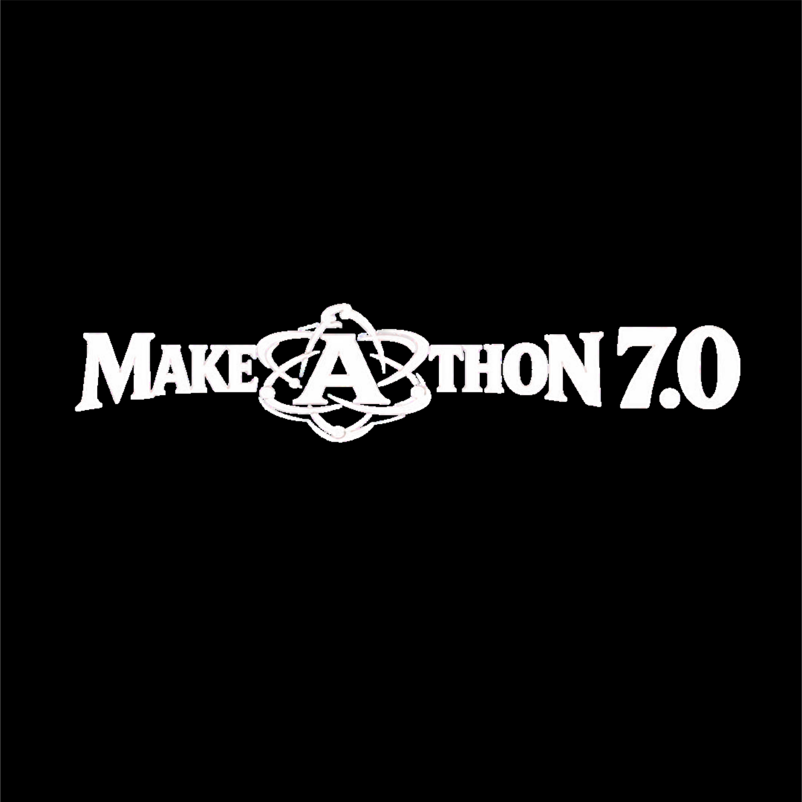
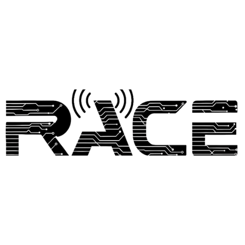
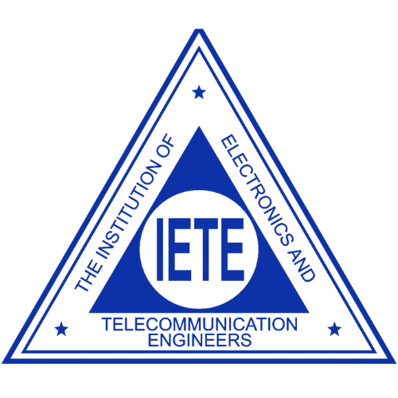
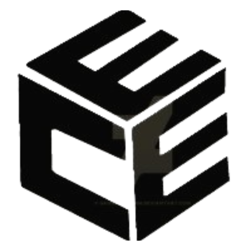

<div align="center">



# MAKE-A-THON 7.0

### 🕷️ *"Anyone can wear the mask."* — Miles Morales

[](https://make-a-thon-7.in/)
[](https://lookerstudio.google.com/u/0/reporting/0df8cf1a-d3dc-4f32-997b-2eeb81116dae)

**National Level 24-Hour Hardware & Software Hackathon**
**Sri Venkateswara College of Engineering, Chennai**

📅 **April 15–16, 2026** &nbsp;|&nbsp; 🏆 **₹1,00,000+ Prize Pool** &nbsp;|&nbsp; 👥 **500+ Participants** &nbsp;|&nbsp; 💼 **10+ Internships**

</div>

---

## 🗺️ Table of Contents

- [About](#-about)
- [Tech Stack](#-tech-stack)
- [Project Structure](#-project-structure)
- [Analytics](#-analytics--google-analytics)
- [Sponsors & Partners](#-sponsors--partners)
- [Organising Bodies](#-organising-bodies)
- [Running Locally](#-running-locally)
- [Contributing](#-contributing)

---

## 🕸️ About

**Make-A-Thon** is the **flagship innovation-driven hackathon** of the Department of Electronics and Communication Engineering, **Sri Venkateswara College of Engineering (SVCE)**.

Now in its **7th edition**, Makeathon 7.0 invites student innovators from institutions across the nation to solve **real-world, industry-oriented problem statements** and build **functional prototypes** within 24 hours — fostering innovation, collaboration, and hands-on learning.

The website takes visual inspiration from **Spider-Man: Into the Spider-Verse** — featuring a cinematic Spider-Verse-themed design with halftone overlays, glitch animations, Spider-Man character cards for each track ("universe"), a scroll-synced animated spider on a web timeline, and a Peter Parker & Miles Morales FAQ section.

> ⚡ **Innovation** &nbsp;|&nbsp; 🤝 **Collaboration** &nbsp;|&nbsp; 🛠️ **Hands-on Learning**

---

## 🛠️ Tech Stack

| Layer | Technology |
|-------|-----------|
| **Core** | HTML5, CSS3 (Vanilla), JavaScript (ES Modules) |
| **Build Tool** | [Vite](https://vitejs.dev/) v8 |
| **Animations** | [GSAP](https://gsap.com/) v3.12 + ScrollTrigger |
| **Smooth Scroll** | [Lenis](https://lenis.darkroom.engineering/) v1.1 |
| **Carousel/Slider** | [Swiper.js](https://swiperjs.com/) v11 |
| **Fonts** | Google Fonts — Anton, Bangers, Montserrat |
| **Analytics** | Google Analytics 4 (`G-HEKCE27K1S`) |
| **Backend (Forms)** | Google Apps Script (`Code.gs`) |
| **Hosting** | GitHub Pages (custom domain via `CNAME`) |
| **Domain** | `make-a-thon-7.in` |

---

## 📁 Project Structure

```
Makeathon/
├── index.html              # Main landing page
├── universe.html           # Individual track/universe detail page
├── track.html              # Track overview page
├── industrial.html         # Industrial problem statements
├── notifications.html      # Event notifications page
├── spiderweb.html          # Spider-web visual page
├── feedback-section.html   # Feedback form section
├── Code.gs                 # Google Apps Script (form/backend logic)
├── CNAME                   # Custom domain config
├── sitemap.xml             # SEO sitemap
├── robots.txt              # Crawler directives
│
├── css/                    # Modular CSS per section
│   ├── base.css            # Design tokens, resets
│   ├── nav.css, hero.css, about.css, timeline.css
│   ├── gallery.css, problems.css, team.css
│   ├── sponsorship.css, faq.css, footer.css
│   ├── loading.css, track.css, tutorial.css
│   └── universe.css, notifications.css
│
├── js/
│   ├── main.js             # App entry point
│   ├── data/
│   │   └── universes.js    # All 12 track & problem statement data
│   ├── sections/           # Section-specific JS (gallery, FAQ, etc.)
│   ├── core/               # Core utilities
│   ├── cursor.js           # Custom cursor
│   ├── tutorial.js         # Onboarding tutorial
│   ├── feedback.js         # Feedback form logic
│   ├── universe.js         # Universe detail page logic
│   └── track.js            # Track page logic
│
└── assets/
    ├── Logo/               # RACE, IETE-SF, ECEA & Makeathon logos
    ├── variants/           # Spider-Man character art per track
    ├── background/         # Universe background images
    ├── gallery_images/     # Past edition photos
    ├── industry_logos/     # Sponsor logos
    ├── partners/           # Partner logos
    ├── page_loading/       # Loading screen frame animation
    ├── home_page_vid.mp4   # Hero background video
    └── ...
```

---

## 📊 Analytics

Makeathon 7.0 uses **Google Analytics 4** (Measurement ID: `G-HEKCE27K1S`) to track visitor engagement. A **public Looker Studio dashboard** is available for anyone to view live stats — no sign-in required.

**🔗 [View the Live Analytics Dashboard →](https://lookerstudio.google.com/u/0/reporting/0df8cf1a-d3dc-4f32-997b-2eeb81116dae)**

> 🎉 The website has crossed **3,000+ active users** since launch!

---

## 🤝 Sponsors & Partners

### 💰 Monetary Sponsors

| Tier | Sponsor |
|------|---------|
| 🥇 **Gold** | [Jeyachandran](https://www.jeyachandran.com/) |
| 🥉 **Bronze** | [Richee Rick Investments](https://www.ricchierichinvestments.com/) |

### 🤝 Category Partners

| Category | Partner |
|----------|---------|
| 🏭 **Product Partner** | [PCB Cupid](https://pcbcupid.com) |
| 🥤 **Beverage Partner** | [Hagg Foods](https://www.haggfoods.com/) |
| 📺 **Media Partner** | [Eventopia](https://eventopia.in/) |
| ⚙️ **Automation & Workflow** | [n8n](https://n8n.io/) |
| 🖥️ **Platform Partner** | [GeeksforGeeks](https://www.geeksforgeeks.org/) |
| 💻 **Coding Partner** | [CodeChef](https://www.codechef.com/) |

### 🔬 Technology Partners

| Partner | Description |
|---------|-------------|
| [Codecrafters](https://codecrafters.io/) | Advanced coding challenges |
| [.XYZ](https://gen.xyz/) | Domain registrar |
| [Interview Cake](https://www.interviewcake.com/) | Interview prep platform |

### 💼 Internship Partners

| Partner |
|---------|
| [Marketview360](https://www.marketview360.io/) |
| [Upcheck](https://www.upcheck.in/) |
| [Softrate Global](https://www.softrateglobal.com) |

---

## 🏛️ Organising Bodies

Make-A-Thon 7.0 is jointly organised by three student associations of the **Department of ECE, SVCE**:

<table>
<tr>
<td align="center" width="33%">
<br/>
<b>RACE</b><br/>
<i>Research Association for Innovative Design in Communication and Electronics</i>
</td>
<td align="center" width="33%">
<br/>
<b>IETE-SF</b><br/>
<i>Institution of Electronics and Telecommunication Engineers – Students' Forum</i>
</td>
<td align="center" width="33%">
<br/>
<b>ECEA</b><br/>
<i>Electronics and Communication Engineers Association</i>
</td>
</tr>
</table>

---

## 💻 Running Locally

```bash
# Clone the repository
git clone https://github.com/sudhans18/Makeathon.git
cd Makeathon

# Install dependencies
npm install

# Start the local development server
npm run dev
```

The site will be available at `http://localhost:5173` (or the port Vite assigns).

> **Note:** This is a static website. No backend server is required. The Google Apps Script (`Code.gs`) handles form submissions and is deployed separately via Google Apps Script.

---

## 🤝 Contributing

This repository is maintained by the Makeathon 7.0 organizing team. If you're a team member and need to make changes:

1. Create a feature branch: `git checkout -b fix/your-fix-name`
2. Make your changes and test locally with `npm run dev`
3. Commit with a descriptive message: `git commit -m "feat: add xyz"`
4. Push and open a Pull Request for review

---

## 📄 License

This project and its contents are the intellectual property of the **Makeathon 7.0 Organizing Committee**, **SVCE**. All rights reserved.

---

<div align="center">

Made with ❤️ by the **Makeathon 7.0 Team** — RACE × IETE-SF × ECEA

**Sri Venkateswara College of Engineering, Chennai**

🌐 [make-a-thon-7.in](https://make-a-thon-7.in/) &nbsp;|&nbsp; 📧 Contact via the website

*"24 hours. Infinite possibilities. Create beyond limits."*

</div>
